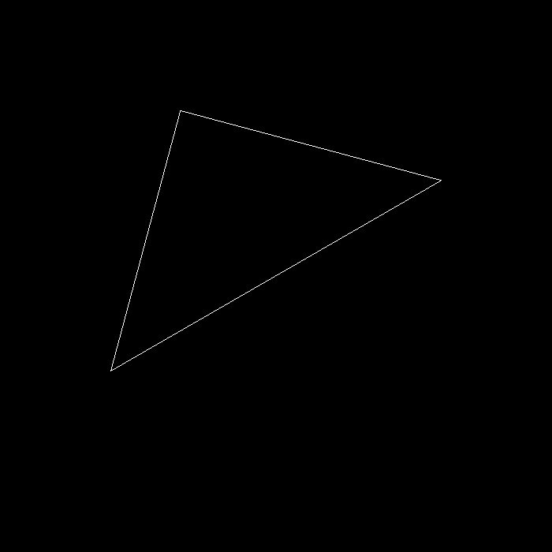

# Homework1
主要的任务是实现三角形绕Z轴的旋转 `./Rasterizer −r 30`，旋转30度结果如下：

`./Rasterizer` A（+10°）D（-10°）键进行旋转：

<video src="Recordings/AD-Rotation.mp4" with="900" height="400"><video>

刚开始旋转的角度并不对，是因为没有转化为弧度制。同时为了验证结果的正确性找到一款3D绘图软件：https://www.geogebra.org/

<video src="Recordings/geogebra.mp4" with="900" height="400"><video>

