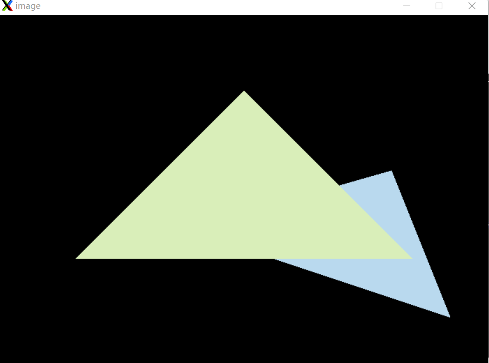

# Homework2

#### 知识点：

光栅化过程：找bounding box，判断像素中心点是否在三角形里（走样问题产生），深度测试。

具体整理可参考：https://dyhnoah.github.io/2022/01/29/Games101-Rasterization/

反走样和黑边问题：https://blog.csdn.net/Xuuuuuuuuuuu/article/details/124172397

#### 主要任务：

在屏幕上画出实心三角形，也就是栅格化三角形。

