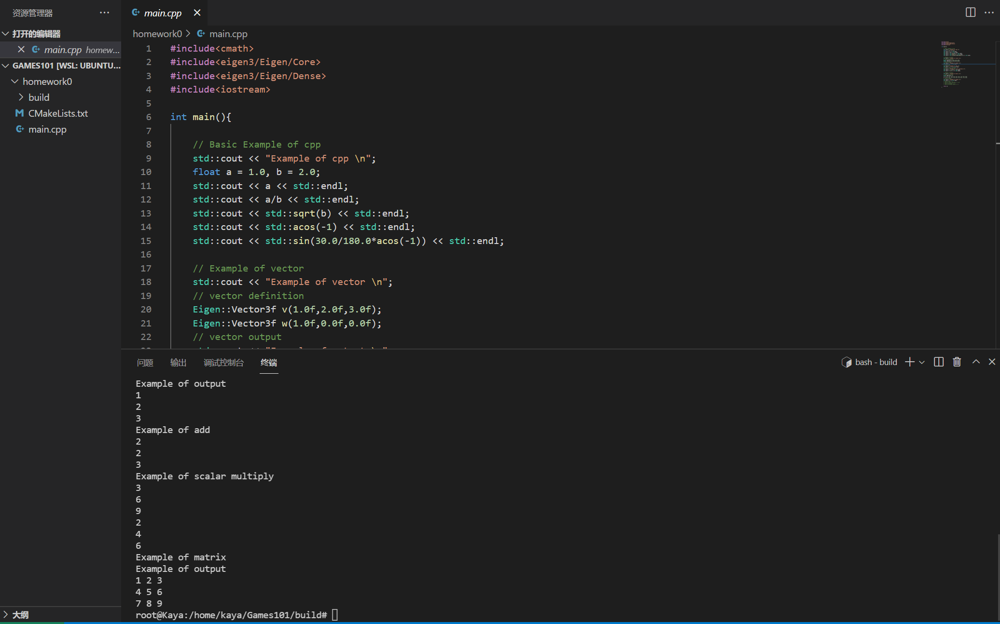
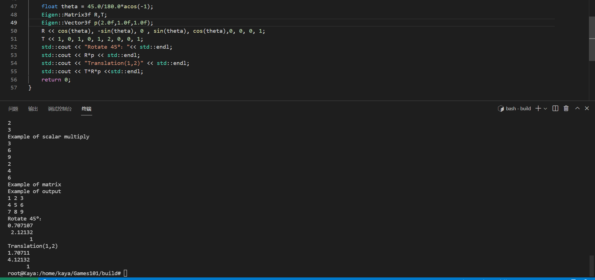

# Game101_work
### 环境配置

WSL2+Ubuntu20.04+vscode

我遇到的问题是把ubuntu迁移到非C盘的磁盘之后，mnt共享文件夹打不开且vscode中无法配置Ubuntu中的编译器。解决办法是：把Ubuntu20.04映射成网络驱动器，之后在home/user路径下创建工作文件夹。再次用vscode打开创建的文件夹就可以正确的编译了。

参考配置教程：

https://zhuanlan.zhihu.com/p/371080057

https://blog.csdn.net/liangnihei/article/details/127918412

### Homework0

测试环境是否正确：

先旋转逆时针45，后平移（1, 2）：齐次坐标知识点，默认旋转是逆时针方向绕原点旋转T*R *p，从右往左做变换。

### Homework1

主要的任务是实现三角形绕Z轴的旋转 `./Rasterizer −r 30`，旋转30度结果如下：

`./Rasterizer` A（+10°）D（-10°）键进行旋转：

<video src="Recordings/AD-Rotation.mp4" with="900" height="400"><video>

刚开始旋转的角度并不对，是因为没有转化为弧度制。同时为了验证结果的正确性找到一款3D绘图软件：https://www.geogebra.org/

<video src="Recordings/geogebra.mp4" with="900" height="400"><video>

